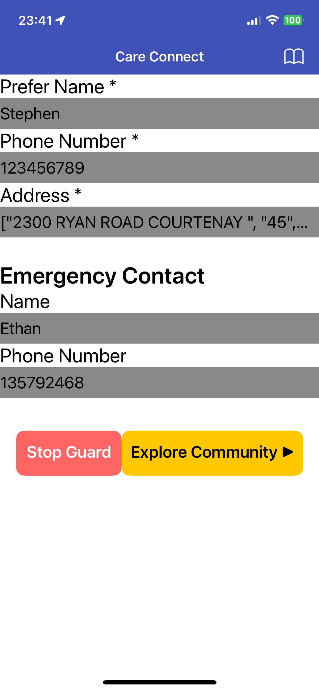
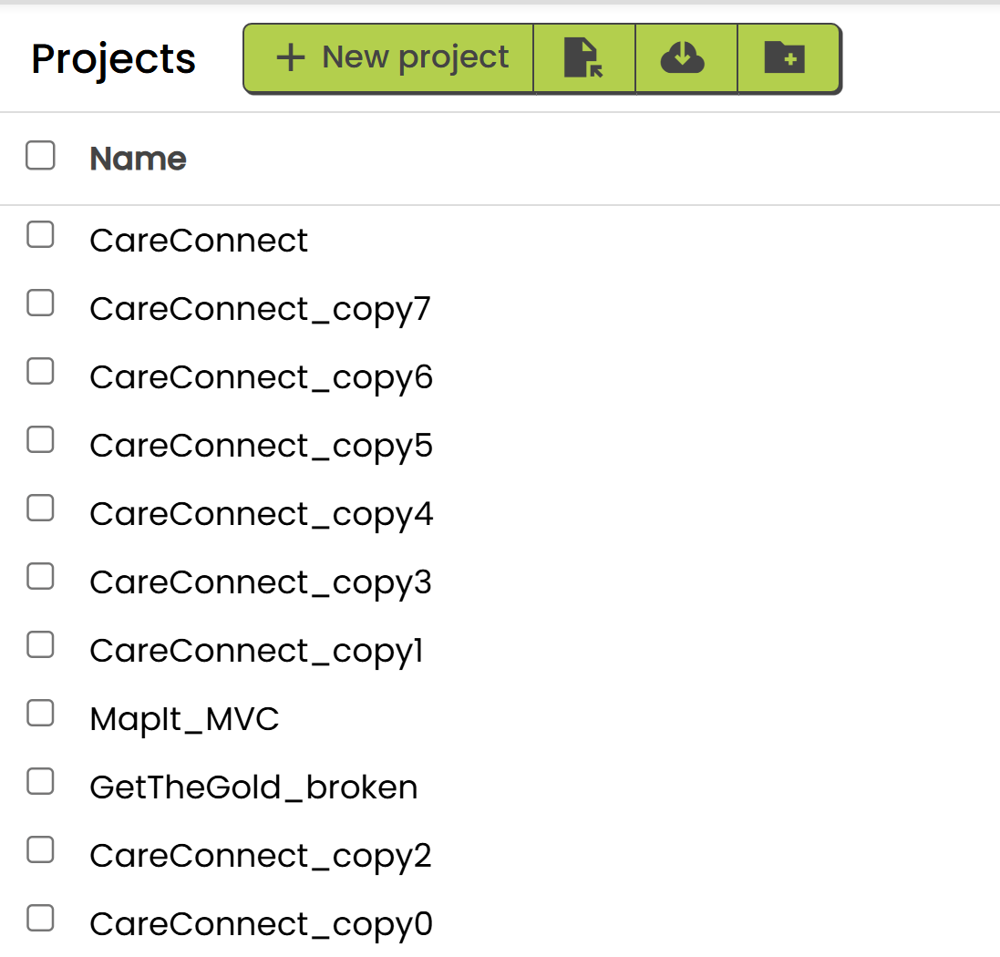

# HangYin's CareConnect App

CareConnect is a mobile application that monitors falls in elderly individuals or patients and notifies the community. This application is designed to enhance the safety and well-being of elderly individuals. Built using MIT App Inventor, this app combines emergency response capabilities with community monitoring in an intuitive, senior-friendly interface.

## 🎯 Motivation

As our population ages, there is an increasing need for technological solutions that support independent living while ensuring safety. CareConnect addresses this need by creating a bridge between elderly individuals and their support network, fostering a connected community of care.

## ✨ Key Features

### Safety & Emergency Response

- **Fall Detection System**: Utilizes phone sensors (accelerometer) to automatically detect falls
- **Emergency Contact System**: One-touch activation with GPS location sharing
- **Community Monitoring**: Connects with local community members and volunteers

### Accessibility

- **Senior-Friendly Interface**: Large buttons, clear text, and intuitive navigation
- **Community Support Integration**: Connects with local community members and volunteers

## 👥 Target Audience

- Elderly individuals maintaining independent living
- Family members
- Retirement community residents
- Community volunteers and support networks

## 🛠 Technical Implementation

Built using MIT App Inventor, CareConnect leverages various device capabilities:

- Accelerometer sensors for fall detection
- GPS and location services
- Local storage(TinyDB) for offline data access
- Map integration for community monitoring

### Fill in Personal Information and Emergency Contact Information

- UI

- Blocks

### "Start Guard" and Fall Detection

- Click "Start Guard" to start the fall detection, and the button will change to "Stop Guard"

- Detected a fall, prompt the user to confirm if they need help

- Blocks

### Map View

- When the user confirms the fall, the map view will be shown

- The community members will be notified and can help the user, and the other users who also need help will be shown on the map as well. Click the list item to show the user's location on the map.

- When the user has been helped, the user can click "I'm alright! Now" to remove the user from the map.

- Blocks

### Community Monitoring

### Debug and Test

- I added a text block to show all information as debug purpose, and it works well.

- I kept lots of versions of my project as version control is not supported in MIT App Inventor.

## 🌟 Social Impact

CareConnect goes beyond individual care by fostering community engagement:

- Enables community members to locate and assist elderly neighbors in need
- Creates a network of volunteers and helpers
- Promotes rapid response to emergencies through community awareness
- Strengthens social bonds within neighborhoods

## ❓Known Issues

- As the fall detection is based on the accelerometer, it may be inaccurate sometimes. I use shaking detection instead to demonstrate the fall detection.

## 📚 References

I completed this project entirely by reading the official documentation, without referencing any existing demos or projects.

- [MIT App Inventor Documentation](https://appinventor.mit.edu/explore/library)
- [MIT App Inventor Tutorials](https://appinventor.mit.edu/explore/ai2/tutorials)
- [MIT App Inventor Components Reference](https://appinventor.mit.edu/explore/ai2/support/blocks)
- [MIT App Inventor Sensor Components](https://appinventor.mit.edu/explore/ai2/support/blocks/sensors)